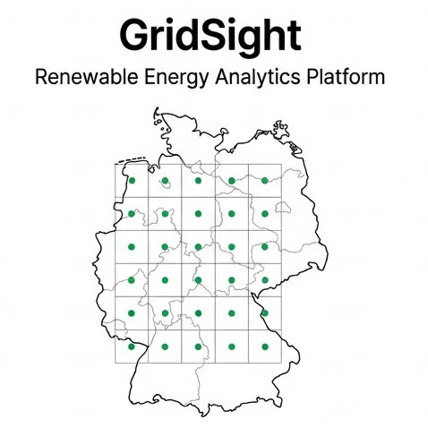
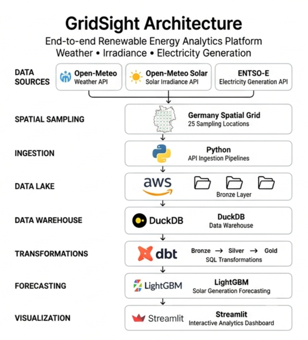

<div align="center">



# GridSight

### Renewable Energy Analytics Platform

An end-to-end data engineering and machine learning platform for renewable energy forecasting using weather, solar irradiance, and electricity generation data.

</div>

---

## Overview

GridSight is an end-to-end renewable energy analytics platform designed to forecast renewable electricity generation across Germany.

The platform ingests historical weather, solar irradiance, and electricity generation data from multiple public APIs, stores raw data in an Amazon S3 Bronze Data Lake, transforms it using dbt on DuckDB, and trains machine learning models for renewable energy forecasting.

The project emphasizes modern data engineering practices including ELT pipelines, cloud storage, data modeling, and analytical feature engineering.

---

## Architecture

<p align="center">
    
</p>

---

## Technology Stack

| Layer | Technology |
|--------|------------|
| Programming | Python, SQL |
| Weather Data | Open-Meteo Weather API |
| Solar Irradiance | Open-Meteo Solar API |
| Electricity Generation | ENTSO-E Transparency Platform |
| Data Lake | Amazon S3 |
| Data Warehouse | DuckDB |
| Transformations | dbt Core |
| Machine Learning | LightGBM, XGBoost, Random Forest |
| Dashboard | Streamlit |

---

## Data Pipeline

```
                APIs
                  │
                  ▼
      Python Data Ingestion Pipelines
                  │
                  ▼
      Amazon S3 Bronze Data Lake
                  │
                  ▼
      DuckDB Analytical Warehouse
                  │
                  ▼
          dbt Transformations
        Bronze → Silver → Gold
                  │
                  ▼
     Feature Engineering & Training
                  │
                  ▼
      Renewable Energy Forecasting
```

---

## Repository Structure

```text
GridSight/
│
├── assets/                # Images and diagrams
├── ingestion/             # API ingestion pipelines
├── warehouse/             # DuckDB loading scripts
├── dbt/                   # SQL transformations
├── models/                # Machine learning
├── dashboard/             # Streamlit application
├── data/                  # Local temporary storage
│
├── config.py
├── logger.py
├── requirements.txt
└── README.md
```

---

## Features

- Historical weather ingestion from Open-Meteo
- Solar irradiance ingestion from Open-Meteo Solar
- Electricity generation ingestion from ENTSO-E
- Automated ELT pipelines
- Amazon S3 Bronze Data Lake
- DuckDB analytical warehouse
- dbt-based data transformations
- Renewable energy forecasting with LightGBM
- Interactive analytics dashboard with Streamlit

---

## License

This project is released under the MIT License.