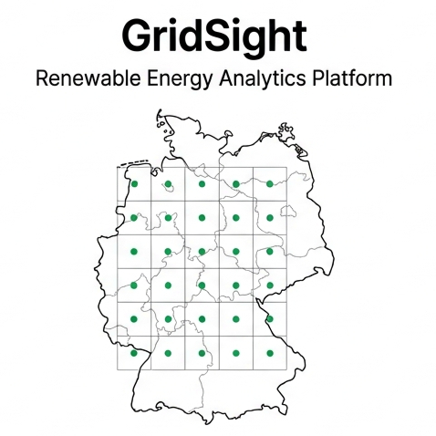
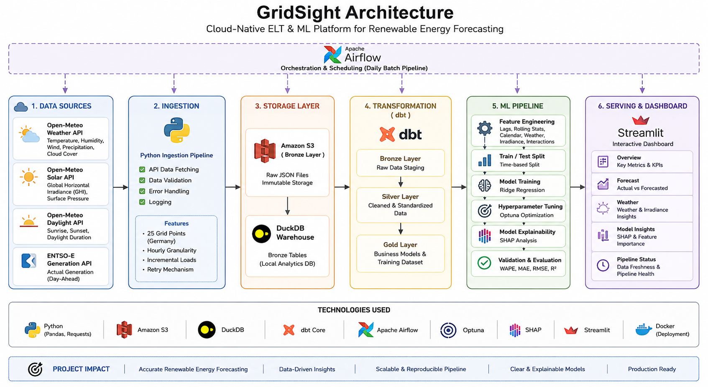
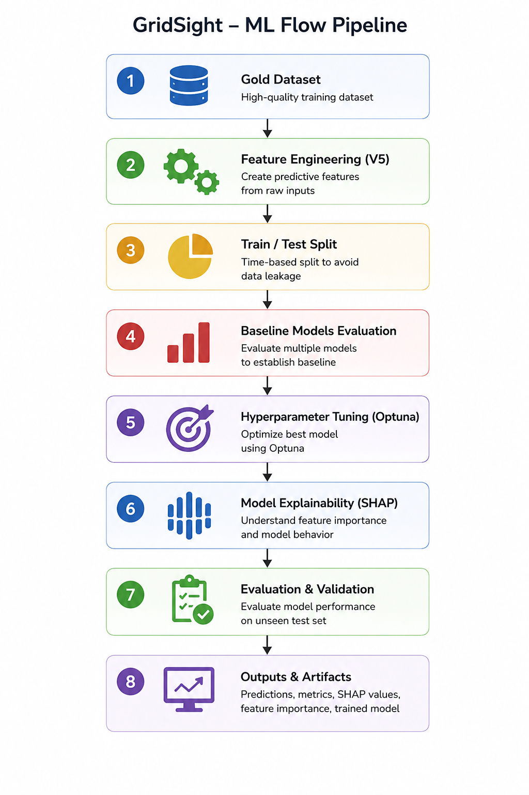
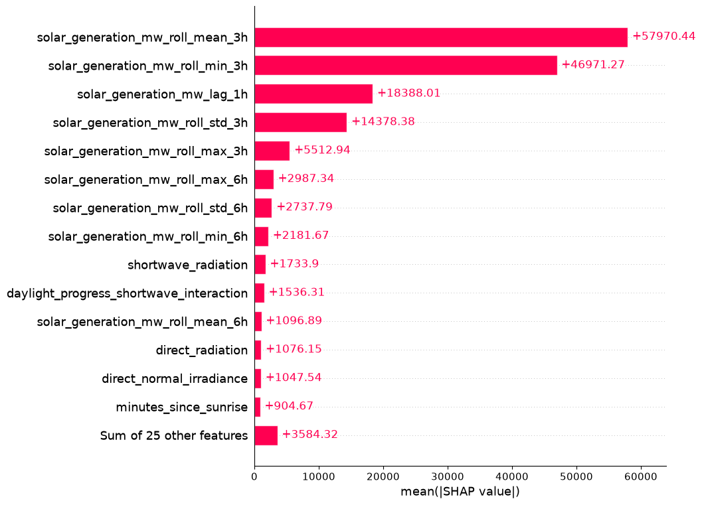

<div align="center">



# GridSight

### End-to-End Renewable Energy Forecasting Platform

*A cloud-native data engineering and machine learning platform for automated solar energy forecasting.*

<br>


</div>

---

# Overview

GridSight is an end-to-end renewable energy forecasting platform designed to demonstrate modern data engineering, analytics engineering, and machine learning practices within a single production-style project.

The platform automates the complete forecasting lifecycle—from data ingestion and storage to feature engineering, model inference, validation, and interactive analytics.

Unlike traditional machine learning projects that primarily focus on predictive performance, GridSight emphasizes building a reproducible, scalable, and production-oriented forecasting system.

---

# Project Highlights

- End-to-end renewable energy forecasting platform
- Automated ELT pipeline orchestrated using Apache Airflow
- Amazon S3 Bronze Data Lake
- DuckDB analytical warehouse
- Medallion Architecture (Bronze → Silver → Gold)
- dbt-powered analytics engineering
- Incremental feature engineering methodology
- Optuna hyperparameter optimization
- SHAP explainability
- Production forecasting pipeline
- Interactive Streamlit dashboard
- Research-oriented experimental framework

---

# Architecture

<div align="center">



</div>

The GridSight architecture follows a modern cloud-native analytics workflow.

```text
Public APIs
      │
      ▼
Python Ingestion
      │
      ▼
Amazon S3 Bronze Data Lake
      │
      ▼
DuckDB Warehouse
      │
      ▼
dbt Transformations
      │
      ▼
Feature Engineering
      │
      ▼
Production Machine Learning
      │
      ▼
Forecast Validation
      │
      ▼
Streamlit Dashboard
```

The architecture separates ingestion, storage, transformation, feature engineering, forecasting, and visualization into independent layers, improving maintainability, reproducibility, and scalability.

---

# Technology Stack

GridSight integrates modern data engineering, analytics engineering, and machine learning technologies to build a reproducible forecasting platform.

| Layer | Technology | Purpose |
|--------|------------|---------|
| Query Language | SQL | Data transformation and analytics |
| Programming | Python | Data ingestion, feature engineering and forecasting |
| Cloud Storage | Amazon S3 | Immutable Bronze Data Lake |
| Analytical Warehouse | DuckDB | High-performance analytical database |
| Analytics Engineering | dbt Core | Data transformations and testing |
| Workflow Orchestration | Apache Airflow | Automated daily pipeline execution |
| Machine Learning | Scikit-learn | Forecasting models |
| Hyperparameter Optimization | Optuna | Automated model tuning |
| Explainability | SHAP | Model interpretation |
| Dashboard | Streamlit | Interactive analytics dashboard |
| Version Control | Git & GitHub | Source code management |

---

# Data Sources

GridSight combines multiple publicly available renewable energy datasets to construct a unified forecasting dataset.

| Source | Data | Granularity |
|---------|------|-------------|
| Open-Meteo Weather API | Temperature, Humidity, Cloud Cover, Wind Speed, Precipitation | Hourly |
| Open-Meteo Solar API | Global Horizontal Irradiance, Direct Radiation, Diffuse Radiation | Hourly |
| Open-Meteo Daily API | Sunrise, Sunset, Daylight Duration | Daily |
| ENTSO-E Transparency Platform | Actual Solar Generation | 15 Minutes |

Weather and irradiance observations are collected from **25 geographically distributed sampling locations** across Germany before being spatially aggregated into national hourly observations.

Generation data is aggregated from **15-minute average power measurements** to an hourly time series, ensuring a consistent temporal grain across all datasets.

---

# Pipeline Workflow

The entire forecasting workflow is fully automated using Apache Airflow.

<div align="center">


</div>

The daily workflow executes in the following order:

```text
Daily API Ingestion
        │
        ▼
Amazon S3 Bronze Storage
        │
        ▼
DuckDB Bronze Loading
        │
        ▼
dbt Transformations
(Bronze → Silver → Gold)
        │
        ▼
Feature Engineering
        │
        ▼
Production Forecast Generation
        │
        ▼
Forecast Validation
        │
        ▼
Streamlit Dashboard
```

Each stage begins only after the successful completion of its upstream dependency, ensuring reliable and reproducible daily forecasting.

Runtime validation is performed throughout the pipeline to detect missing data, incomplete feature vectors, and invalid forecast outputs before predictions are persisted.

---

# Data Architecture

GridSight follows the **Medallion Architecture**, separating raw, standardized, and analytical datasets into independent layers.

<div align="center">


</div>

| Layer | Purpose |
|-------|---------|
| Bronze | Immutable raw API responses stored in Amazon S3 |
| Silver | Cleaned, standardized, and integrated datasets |
| Gold | Machine-learning-ready feature tables |

This layered approach improves reproducibility, data lineage, and maintainability while ensuring that every transformation remains traceable back to the original source data.

The Gold layer contains the complete feature set required for model training and production inference, eliminating the need for additional preprocessing during forecasting.

---

# Machine Learning Methodology

GridSight follows an incremental feature engineering methodology designed to evaluate the contribution of each feature group under controlled experimental conditions.

Rather than introducing all engineered features simultaneously, feature groups are added progressively, allowing performance improvements to be attributed to specific engineering decisions.

<div align="center">



</div>

The experimentation workflow follows the sequence below.

```text
Gold Feature Dataset
        │
        ▼
Feature Engineering Versions (V0 → V5)
        │
        ▼
Baseline Model Training
        │
        ▼
Performance Evaluation
        │
        ▼
Hyperparameter Optimization
        │
        ▼
Production Model Selection
        │
        ▼
Feature Ablation
        │
        ▼
SHAP Explainability
        │
        ▼
Daily Batch Forecasting
```

Only one feature group is introduced between consecutive versions, ensuring that performance improvements remain measurable and reproducible.

---

# Feature Engineering

Feature engineering is the primary focus of GridSight.

Each feature group is introduced independently before evaluating its impact on forecasting accuracy.

| Version | Feature Group |
|----------|---------------|
| V0 | Historical Generation Baseline |
| V1 | Weather & Solar Irradiance |
| V2 | Calendar Features |
| V3 | Lag Features |
| V4 | Rolling Statistics |
| V5 | Daylight & Interaction Features |

The final production dataset contains:

- Historical lag features
- Rolling statistical features
- Weather observations
- Solar irradiance measurements
- Daylight characteristics
- Calendar variables
- Interaction features

---

# Model Development

Three forecasting models were evaluated using identical datasets and train/test splits.

| Model | Purpose |
|--------|---------|
| Ridge Regression | Linear baseline and production model |
| XGBoost | Gradient boosting benchmark |
| LightGBM | Histogram-based gradient boosting benchmark |

Each model was evaluated using:

- WAPE (Primary Metric)
- MAE
- RMSE

Hyperparameter optimization was performed using Optuna before selecting the final production model.

---

# Experimental Results

<div align="center">


</div>

| Model | Optimized | WAPE |
|--------|:---------:|-----:|
| Ridge Regression | ✅ | **7.79%** |
| XGBoost | ✅ | 10.48% |
| LightGBM | ✅ | 10.79% |

Key observations:

- Rolling statistical features produced the largest improvement.
- Interaction features further improved forecasting performance.
- Ridge Regression achieved the best overall forecasting accuracy following hyperparameter optimization.
- Feature engineering contributed more to predictive performance than increasing model complexity.

---

# Explainability

<div align="center">



</div>

Model predictions are interpreted using SHAP (SHapley Additive exPlanations).

Explainability is used to:

- Rank feature importance
- Understand local model predictions
- Validate feature engineering decisions
- Compare learned relationships with domain knowledge

SHAP analysis is performed only after selecting the final production model.

---

---

# Production Pipeline

GridSight is designed as an automated batch forecasting platform where the complete forecasting workflow executes without manual intervention.

Apache Airflow orchestrates every stage of the pipeline, ensuring data dependencies are respected and forecasts are generated only after successful upstream execution.

<div align="center">


</div>

The production pipeline consists of the following stages:

| Stage | Description |
|--------|-------------|
| API Ingestion | Collects weather, solar irradiance, daylight, and generation data |
| Bronze Loading | Stores immutable raw datasets in Amazon S3 |
| Warehouse Loading | Loads raw datasets into DuckDB |
| dbt Transformations | Creates standardized Silver and Gold tables |
| Feature Engineering | Generates production-ready model features |
| Forecast Generation | Produces hourly solar generation forecasts |
| Validation | Verifies feature completeness and forecast quality |
| Dashboard Refresh | Makes the latest forecasts available through Streamlit |

The modular design enables each component to be developed, tested, and maintained independently while ensuring a reliable end-to-end forecasting workflow.

---

# Data Quality & Validation

Reliable forecasts require reliable data.

GridSight incorporates automated validation checks throughout the pipeline to identify incomplete or inconsistent data before model inference.

The validation framework includes:

- Dataset existence verification
- Empty table detection
- Required column validation
- Timestamp consistency checks
- Missing feature detection
- Null value validation
- Forecast completeness verification

These checks prevent invalid forecasts from being generated while improving the robustness of the production workflow.

---

# Dashboard

GridSight includes an interactive Streamlit dashboard for exploring forecasts, historical generation, weather conditions, and model performance.

<div align="center">


</div>

The dashboard provides four analytical views.

| Page | Purpose |
|------|---------|
| Forecast Overview | Visualize historical and predicted solar generation |
| Weather Analytics | Explore meteorological conditions and irradiance |
| Model Performance | Evaluate forecasting accuracy and model metrics |
| Pipeline Health | Monitor pipeline execution and data freshness |

The dashboard automatically reflects the latest forecasts generated by the production pipeline, providing an up-to-date view of renewable energy generation.

---

# Repository Structure

```text
GridSight/
│
├── airflow/                  # Workflow orchestration
├── assets/                   # README images and diagrams
├── dashboard/                # Streamlit application
├── database/                 # DuckDB warehouse
├── dbt/                      # dbt project
│   ├── models/
│   ├── tests/
│   └── macros/
├── models/                   # Trained ML models
├── notebooks/                # Research notebooks
├── src/
│   ├── ingestion/
│   ├── preprocessing/
│   ├── feature_engineering/
│   ├── forecasting/
│   ├── validation/
│   └── utils/
├── requirements.txt
└── README.md
```

The repository follows a modular architecture that separates ingestion, transformation, feature engineering, forecasting, validation, orchestration, and visualization into independent components.

---

# Results at a Glance

| Metric | Result |
|---------|-------:|
| Production Model | Ridge Regression |
| Final WAPE | **7.79%** |
| Hyperparameter Optimization | Optuna |
| Explainability | SHAP |
| Storage Layer | Amazon S3 |
| Analytical Warehouse | DuckDB |
| Data Transformations | dbt Core |
| Workflow Orchestration | Apache Airflow |
| Dashboard | Streamlit |
| Pipeline | Fully Automated Batch Forecasting |

---

# Key Achievements

GridSight demonstrates the implementation of a complete production-style renewable energy forecasting platform.

Major outcomes include:

- Automated end-to-end ELT pipeline
- Cloud-native Bronze Data Lake using Amazon S3
- DuckDB analytical warehouse
- dbt-powered Medallion Architecture
- Incremental feature engineering framework (V0–V5)
- Hyperparameter optimization using Optuna
- SHAP-based model explainability
- Automated production forecasting pipeline
- Interactive Streamlit dashboard
- Fully orchestrated workflow using Apache Airflow

---

# Future Enhancements

Potential extensions to the platform include:

- Docker containerization
- Cloud deployment on AWS
- CI/CD pipeline using GitHub Actions
- Real-time streaming ingestion with Apache Kafka
- Automated model retraining
- Model monitoring and drift detection
- Multiple renewable energy sources (Wind & Hydro)
- Multi-region forecasting support
- REST API for forecast serving

---

# Acknowledgements

GridSight is built using open-source technologies and publicly available datasets.

### Technologies

- Python
- SQL
- DuckDB
- dbt Core
- Apache Airflow
- Scikit-learn
- Streamlit
- Optuna
- SHAP

### Data Providers

- Open-Meteo Weather API
- Open-Meteo Solar API
- ENTSO-E Transparency Platform

Special thanks to the maintainers and contributors of these projects for making renewable energy analytics more accessible.

---

# License

This project is licensed under the MIT License.

See the `LICENSE` file for additional information.

---

<div align="center">

### If you found this project interesting, consider giving it a ⭐

</div>
