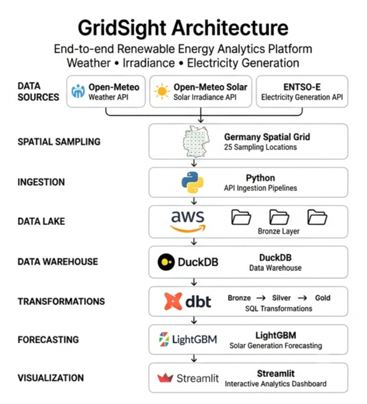

<div align="center">


# GridSight

### Renewable Energy Analytics Platform

An end-to-end data engineering and machine learning platform for renewable energy forecasting using weather, solar irradiance, and electricity generation data.

</div>

---

## Overview

GridSight is an end-to-end renewable energy analytics platform for forecasting hourly solar electricity generation across Germany.

The platform ingests historical weather, solar irradiance, daylight, and electricity generation data from public APIs, stores raw data in an Amazon S3 Bronze Data Lake, transforms it using DuckDB and dbt following the Medallion Architecture, and trains machine learning models through a reproducible experimentation pipeline.

Rather than focusing solely on model accuracy, GridSight emphasizes reproducible data engineering, feature engineering, experiment tracking, and explainable machine learning.

---

## Architecture

<p align="center">
    
</p>

---

## Technology Stack

| Layer | Technology |
|--------|------------|
| Programming | Python, SQL |
| Weather Data | Open-Meteo Weather API |
| Solar Irradiance | Open-Meteo Solar API |
| Electricity Generation | ENTSO-E Transparency Platform |
| Data Lake | Amazon S3 |
| Data Warehouse | DuckDB |
| Transformations | dbt Core |
| Machine Learning | Linear Regression, XGBoost, LightGBM |
| Experiment Tracking | pandas (MLflow planned) |
| Dashboard | Streamlit |

---

## Data Pipeline

```
                APIs
                  │
                  ▼
      Python Data Ingestion Pipelines
                  │
                  ▼
      Amazon S3 Bronze Data Lake
                  │
                  ▼
      DuckDB Analytical Warehouse
                  │
                  ▼
          dbt Transformations
        Bronze → Silver → Gold
                  │
                  ▼
     Feature Engineering & Training
                  │
                  ▼
      Renewable Energy Forecasting
```

---

## Machine Learning Pipeline

The forecasting workflow follows an incremental feature engineering strategy.

```text
Gold Dataset
      │
      ▼
Train / Test Split
      │
      ▼
Feature Versions (V0 → V5)
      │
      ▼
Linear Regression
XGBoost
LightGBM
      │
      ▼
Performance Evaluation
(MAE • RMSE • WAPE)
      │
      ▼
Best Model Selection
      │
      ▼
SHAP Explainability
      │
      ▼
Forecast Deployment
```

---

## Repository Structure

```text
GridSight/
│
├── assets/                # Images and diagrams
├── ingestion/             # API ingestion pipelines
├── warehouse/             # DuckDB loading scripts
├── dbt/                   # SQL transformations
├── notebooks/                # Machine learning
├── dashboard/             # Streamlit application
├── data/                  # Local temporary storage
│
├── config.py
├── logger.py
├── requirements.txt
└── README.md
```

---

## Features

### Data Engineering

- Automated API ingestion pipelines
- Amazon S3 Bronze Data Lake
- DuckDB analytical warehouse
- Medallion Architecture (Bronze, Silver, Gold)
- dbt transformations and testing
- Reproducible feature engineering

### Machine Learning

- Incremental feature engineering experiments
- Automated comparison of multiple models
- Linear Regression, XGBoost and LightGBM
- WAPE, MAE and RMSE evaluation
- Actual vs Predicted performance visualization
- Feature ablation (planned)
- SHAP explainability (planned)

### Analytics

- Interactive Streamlit dashboard
- Hourly solar generation forecasting

---

## Initial Results

The baseline experimentation pipeline compares three machine learning models across six incremental feature engineering versions.

Current observations:

- Feature engineering reduced WAPE from approximately **47% to 8%**.
- Rolling statistical features produced the largest improvement.
- Interaction features provided additional performance gains.
- Linear Regression currently outperforms XGBoost and LightGBM under default hyperparameters.

Further improvements through hyperparameter tuning, feature ablation and SHAP explainability are currently in progress.

---

## License

This project is released under the MIT License.