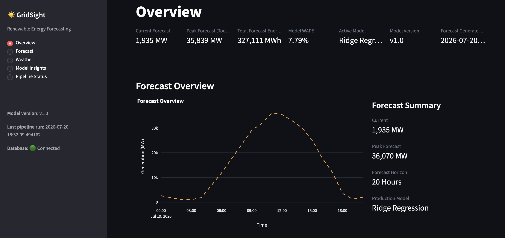
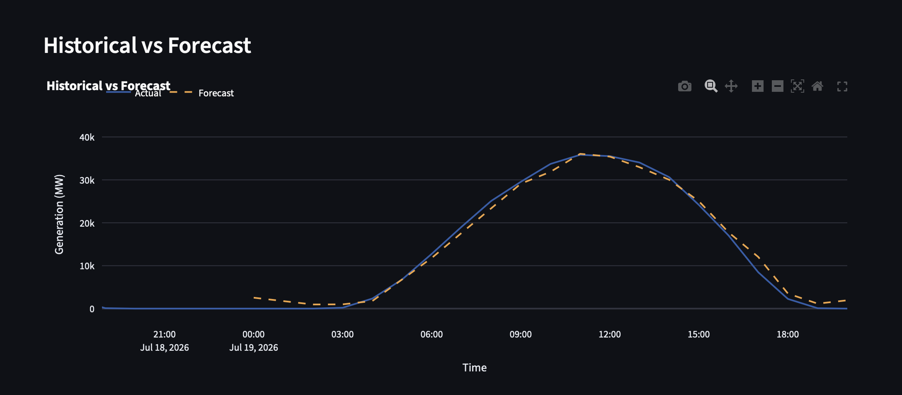
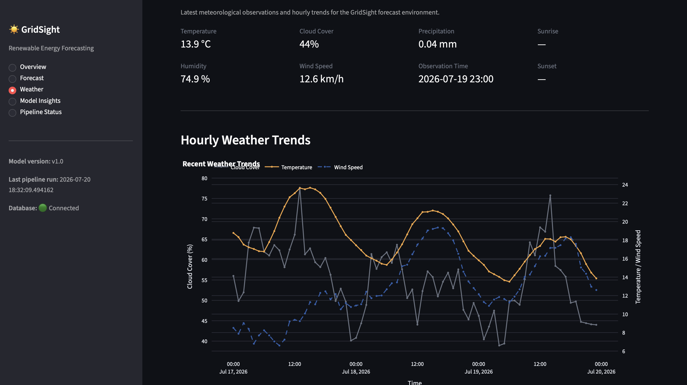
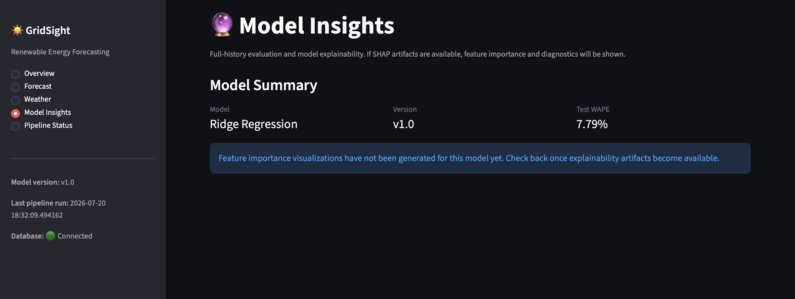
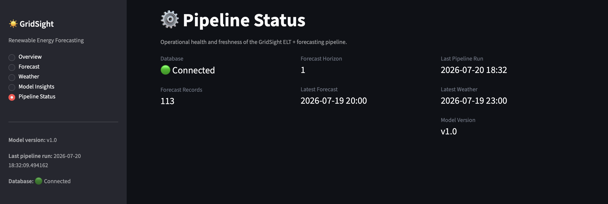
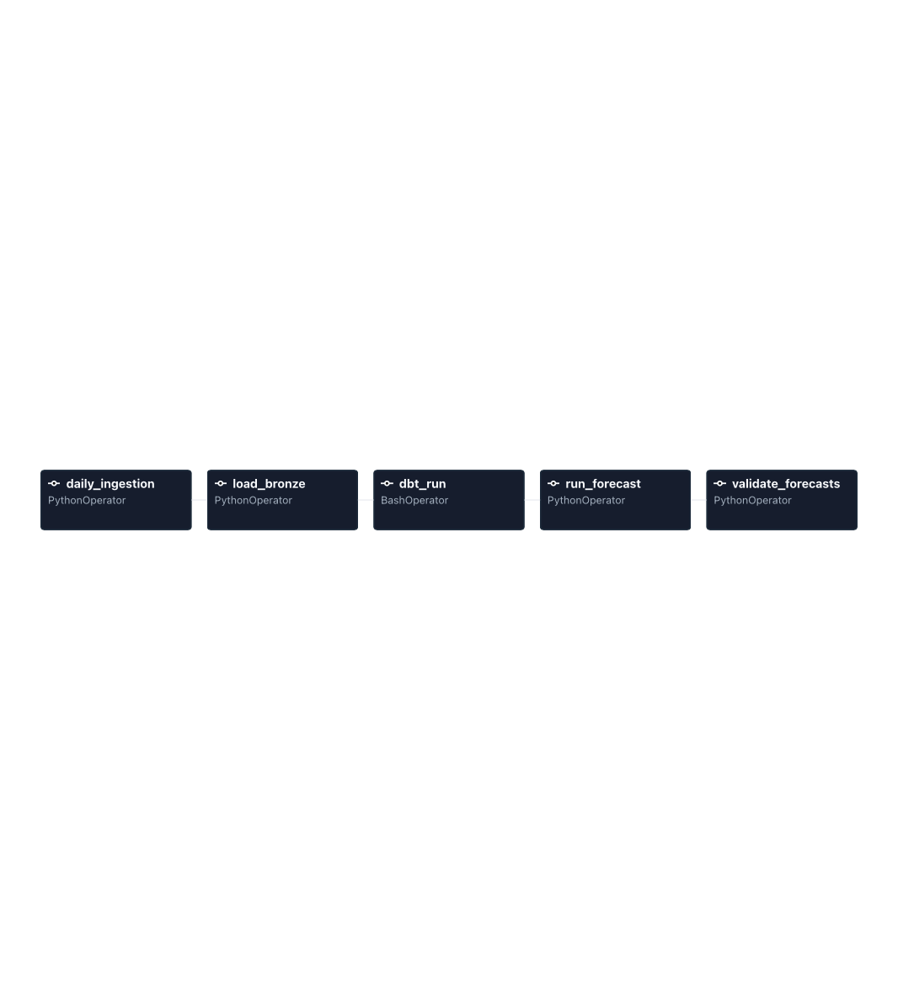
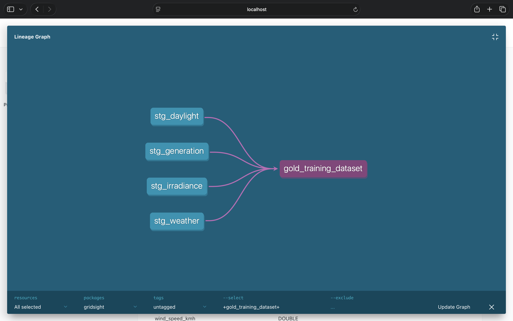
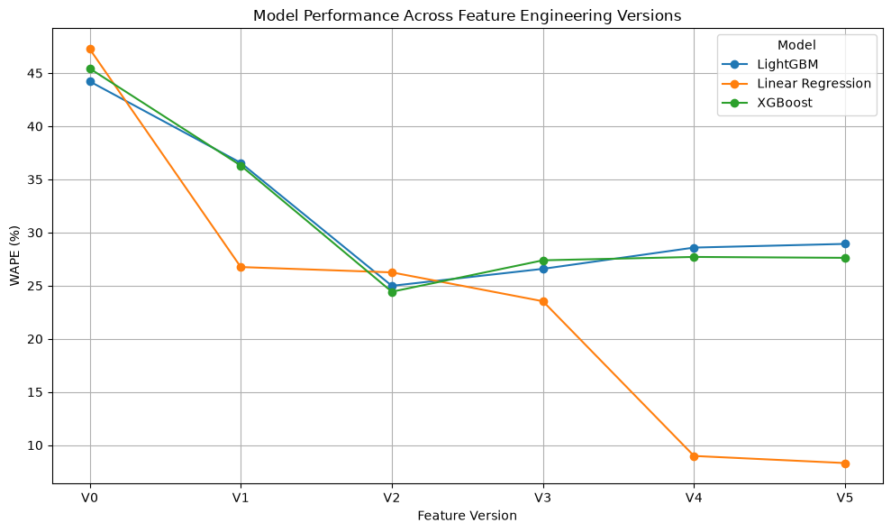

<div align="center">


# GridSight

### Cloud-Native Renewable Energy Forecasting Platform

*A production-style data engineering and machine learning platform for automated solar energy forecasting.*

[]()
[]()
[]()
[]()
[]()
[]()
[]()
[]()

</div>

---

# 🚀 Live Demo

**Dashboard:** https://gridsight-dashboard.streamlit.app/

Explore:

- Forecast Overview
- Interactive Forecasts
- Weather Analytics
- Model Insights
- Pipeline Status

## 🎯 Why GridSight?

GridSight demonstrates how modern data engineering and machine learning components work together in a production-style forecasting system.

Key capabilities include:

- Automated ELT pipeline with Apache Airflow
- Cloud-native Bronze Data Lake using Amazon S3
- Medallion architecture with dbt and DuckDB
- Feature engineering framework for time-series forecasting
- Hyperparameter optimization with Optuna
- Explainable AI using SHAP
- Interactive analytics dashboard with Streamlit

---

# Overview

GridSight is an end-to-end renewable energy forecasting platform built to demonstrate modern **Data Engineering**, **Analytics Engineering**, and **Machine Learning** practices in a production-style workflow.

The platform automates the complete forecasting lifecycle—from data ingestion and transformation to feature engineering, model inference, orchestration, and interactive visualization.

Unlike traditional ML projects that focus solely on model accuracy, GridSight emphasizes **building a reproducible, scalable, and cloud-native forecasting system.**

---

# ✨ Key Features

- Cloud-native ELT pipeline using Amazon S3, DuckDB, dbt and Airflow
- Medallion Architecture (Bronze → Silver → Gold)
- Automated daily batch forecasting
- Incremental feature engineering framework (V0 → V5)
- Hyperparameter optimization using Optuna
- SHAP model explainability
- Interactive Streamlit dashboard
- Production-ready modular architecture

---

# 📊 Dashboard Showcase

## Overview



---

## Forecast



---

## Weather



---

## Model Insights



---

## Pipeline Status



---

# 🏗️ System Architecture


GridSight follows a modern cloud-native architecture that separates ingestion, storage, transformation, feature engineering, forecasting, orchestration, and visualization into independent layers for improved scalability and maintainability.

---

# 🛠️ Technology Stack

| Layer | Technology |
|--------|------------|
| Programming | Python |
| Query Language | SQL |
| Cloud Storage | Amazon S3 |
| Data Warehouse | DuckDB |
| Analytics Engineering | dbt Core |
| Workflow Orchestration | Apache Airflow |
| Machine Learning | Scikit-learn |
| Hyperparameter Optimization | Optuna |
| Explainability | SHAP |
| Dashboard | Streamlit |
| Version Control | Git & GitHub |

---

# 📡 Data Sources

GridSight combines multiple public datasets to generate hourly solar energy forecasts for Germany.

| Source | Data |
|--------|------|
| Open-Meteo Weather API | Temperature, Humidity, Cloud Cover, Wind Speed, Precipitation |
| Open-Meteo Solar API | Global Horizontal Irradiance (GHI), Direct & Diffuse Radiation |
| Open-Meteo Daily API | Sunrise, Sunset, Daylight Duration |
| ENTSO-E Transparency Platform | Actual Solar Generation |

Weather and irradiance data are collected from **25 geographically distributed locations** across Germany before being aggregated into a unified hourly dataset.

---

# ⚙️ Pipeline Workflow



The entire forecasting workflow is orchestrated using **Apache Airflow**, enabling automated daily execution from data ingestion through dashboard updates.

```text
Public APIs
      │
      ▼
Amazon S3 Bronze Layer
      │
      ▼
DuckDB Warehouse
      │
      ▼
dbt Transformations
      │
      ▼
Feature Engineering
      │
      ▼
Model Inference
      │
      ▼
Forecast Validation
      │
      ▼
Streamlit Dashboard
```

---

# 🥇 Medallion Architecture



| Layer | Purpose |
|--------|---------|
| 🟤 Bronze | Raw immutable API data stored in Amazon S3 |
| ⚪ Silver | Cleaned and standardized datasets |
| 🟡 Gold | Machine-learning-ready feature tables |

This layered architecture improves reproducibility, data lineage, and maintainability while keeping raw and transformed data clearly separated.

---

# 🧠 Feature Engineering

Feature engineering was developed incrementally to measure the impact of each feature group on forecasting accuracy.

| Version | Added Features |
|----------|----------------|
| V0 | Historical Generation Baseline |
| V1 | Weather & Solar Irradiance |
| V2 | Calendar Features |
| V3 | Lag Features |
| V4 | Rolling Statistics |
| V5 | Daylight & Interaction Features |

The final production dataset includes:

- Historical lag features
- Rolling statistical features
- Weather observations
- Solar irradiance measurements
- Calendar variables
- Daylight characteristics
- Feature interactions

---

# 🤖 Model Development

Three forecasting models were trained and evaluated using identical train/test splits.

| Model | Role |
|--------|------|
| Ridge Regression | ✅ Production Model |
| XGBoost | Benchmark |
| LightGBM | Benchmark |

Each model was evaluated using:

- WAPE (Primary Metric)
- MAE
- RMSE

Hyperparameter optimization was performed using **Optuna**, followed by feature ablation and SHAP explainability to validate the final production model.

---

# 📈 Results



| Model | WAPE |
|--------|-----:|
| 🥇 Ridge Regression | **7.79%** |
| XGBoost | 10.48% |
| LightGBM | 10.79% |

### Key Findings

- Rolling statistical features produced the largest performance improvement.
- Feature engineering had a greater impact than increasing model complexity.
- Ridge Regression achieved the best forecasting accuracy after Optuna optimization.

# ✅ Data Quality & Validation

To ensure reliable forecasts, GridSight performs automated validation throughout the pipeline before model inference.

Validation checks include:

- Dataset existence verification
- Required column validation
- Timestamp consistency
- Missing feature detection
- Null value validation
- Forecast completeness verification

These checks prevent invalid data from propagating through the forecasting pipeline.

---

# 📂 Repository Structure

```text
GridSight/
│
├── airflow/                 # Airflow DAGs
├── assets/                  # README images & diagrams
├── database/                # DuckDB warehouse
├── dbt/                     # dbt project
├── models/                  # Trained models & metrics
├── notebooks/               # Research notebooks
├── src/
│   ├── feature_engineering/
│   ├── forecasting/
│   ├── ingestion/
│   ├── preprocessing/
│   ├── validation/
│   └── utils/
├── streamlit_app/           # Interactive dashboard
├── requirements.txt
└── README.md
```

---

# 📊 Results at a Glance

| Metric | Value |
|---------|------:|
| Production Model | Ridge Regression |
| Final WAPE | **7.79%** |
| Weather Sampling Locations | **25** |
| Architecture | Medallion (Bronze → Silver → Gold) |
| Storage | Amazon S3 |
| Warehouse | DuckDB |
| Transformations | dbt Core |
| Orchestration | Apache Airflow |
| Dashboard | Streamlit |

---

# 🔮 Future Enhancements

- Docker containerization
- AWS cloud deployment
- CI/CD with GitHub Actions
- Real-time streaming using Apache Kafka
- Automated model retraining
- Model drift monitoring
- Wind & hydro forecasting
- Multi-region forecasting

---

# 🙏 Acknowledgements

GridSight is built using open-source technologies and publicly available datasets.

### Technologies

- Python
- SQL
- DuckDB
- dbt Core
- Apache Airflow
- Scikit-learn
- Streamlit
- Optuna
- SHAP

### Data Providers

- Open-Meteo Weather API
- Open-Meteo Solar API
- ENTSO-E Transparency Platform

---

# 📄 License

This project is licensed under the MIT License.

See the `LICENSE` file for details.

---

<div align="center">

### ⭐ If you found this project useful, consider giving it a star!

**Built by Divjyot Singh Suri**

</div>
